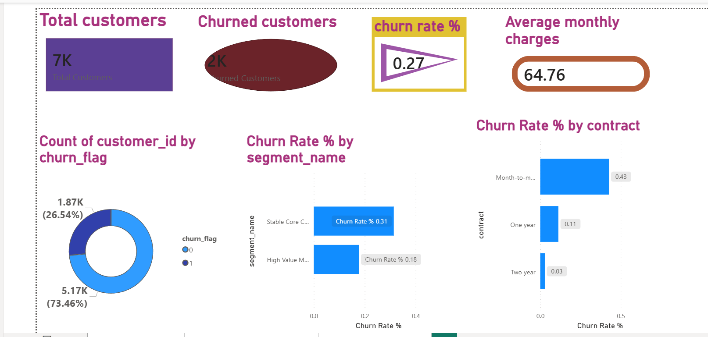
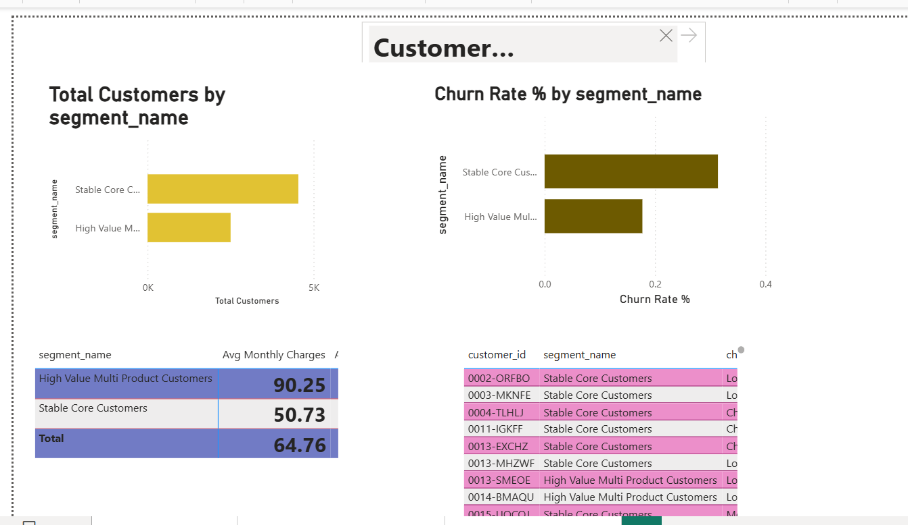
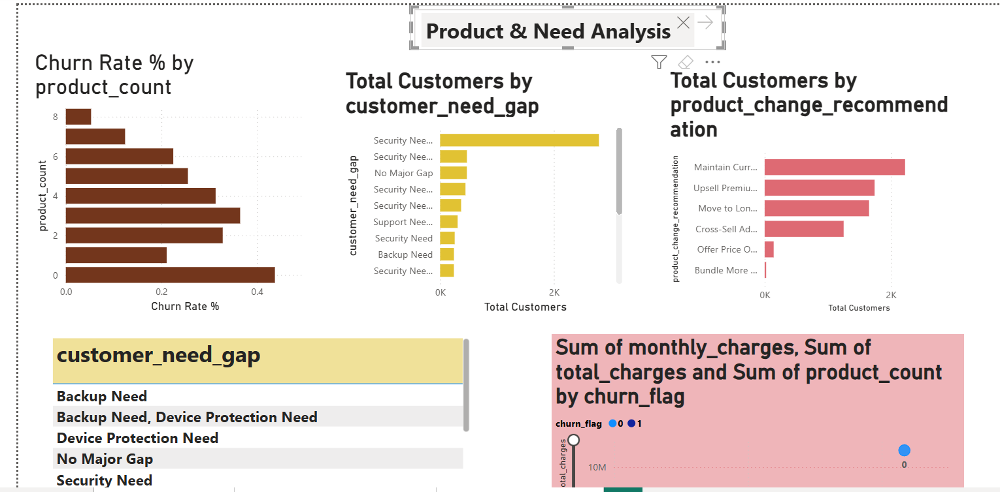

# Market Research — Customer Churn Analysis

End-to-end churn analytics project using the IBM Telco Customer dataset — covering customer behaviour analysis, churn driver identification, product need gap analysis, and customer segmentation, with a 3-page Power BI dashboard and targeted retention recommendations.

**Stack:** Python · SQL · scikit-learn · Power BI  
**Domain:** Telecom · Customer Retention · Market Research

---

## Business Problem

Telecom companies face high customer churn, particularly from customers on flexible contracts with limited product engagement. Retaining existing customers is significantly cheaper than acquiring new ones. This project identifies which customers are most likely to churn, why they churn, and what actions can reduce churn risk.

---

## Dataset

| Attribute | Value |
|---|---|
| Source | IBM Telco Customer Churn (Kaggle) |
| Total Customers | 7,043 |
| Churned Customers | ~1,869 |
| Churn Rate | ~26.5% |
| Features | 21 (demographics, services, contract type, billing, tenure) |

---

## Project Structure

```
├── data/
│   ├── raw/                              # Original IBM Telco CSV
│   └── processed/                        # Cleaned and segmented outputs
│       ├── customer_market_analysis.csv
│       ├── customer_segments.csv
│       ├── churn_summary.csv
│       └── product_need_analysis.csv
├── python/
│   └── churn_analysis.ipynb              # EDA, feature engineering, model, segmentation
├── SQ/
│   └── churn_queries.sql                 # SQL analysis queries
├── powerbi/
│   └── screenshots/
│       ├── Executive_summary.png
│       ├── Customer_Segmentation.png
│       └── Product_need_analysis.png
└── README.md
```

---

## Tech Stack

| Tool | Purpose |
|---|---|
| Python (pandas, Matplotlib) | Data cleaning, EDA, feature engineering |
| scikit-learn | Churn classification, customer clustering |
| SQL | Business reporting queries, churn summary |
| Power BI + DAX | 3-page interactive dashboard |

---

## Analysis Areas

1. **Customer Churn Analysis** — churn rate by contract type, tenure band, and payment method
2. **Product Usage Analysis** — service adoption rates and relationship to churn
3. **Customer Need Gap Analysis** — services missing from high-churn segments
4. **Product Change Recommendations** — contract and bundle strategies to reduce churn
5. **Customer Segmentation** — behavioural clusters for targeted marketing
6. **Retention Campaign Targeting** — prioritisation by risk score and revenue value

---

## Power BI Dashboards

### Executive Summary
Overall churn rate, active vs churned customers, revenue KPIs, and monthly trend.

[

### Customer Segmentation
Behavioural clusters for targeted marketing campaigns based on tenure, product count, and contract type.

[

### Product Need Analysis
Service adoption gaps driving churn — online security, tech support, and backup service missing from high-risk segments.

[

---

## Key Insights

1. Month-to-month customers churn at a significantly higher rate than customers on annual or two-year contracts.
2. Customers with fewer than 2 active services have weaker relationship depth and higher churn risk.
3. Missing online security, backup, and tech support represent measurable product need gaps in churned segments.
4. High monthly charges combined with short tenure (under 12 months) are the strongest combined churn predictor.
5. Long-tenure customers with multiple products form the most stable, high-value segment — and need loyalty protection.
6. Customers with high monthly charges and low product count should be the primary retention campaign target.

---

## Business Recommendations

| Action | Target Segment |
|---|---|
| Migrate to discounted annual/two-year contracts | Month-to-month customers, especially tenure < 12 months |
| Bundle security + tech support + backup as a value package | Customers with 1–2 active services |
| Offer loyalty pricing | High-tenure, high-value customers at risk of price sensitivity |
| Priority retention outreach | High monthly charge + low product count + month-to-month contract |
| Cross-sell online security as entry product | New customers in first 3 months |

---

## Getting Started

```bash
pip install pandas numpy matplotlib scikit-learn jupyter

jupyter notebook python/churn_analysis.ipynb
```

---

## Author

**Revathy Shanmugaraj** · [github.com/Revashan](https://github.com/Revashan)
